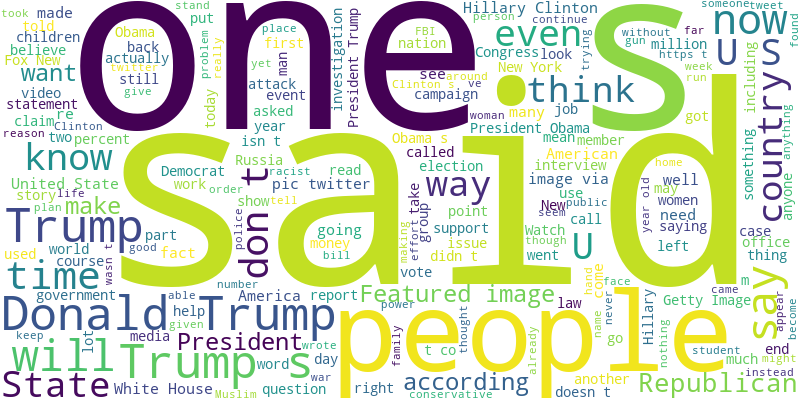

# 📰 Fake News Detection using Machine Learning

A simple end-to-end fake news detection project built with **Python, Scikit-learn, and Streamlit**.
This project aims to classify news articles as **real** or **fake** using traditional ML methods (TF-IDF + Logistic Regression).

> ⚠️ *Current model achieves around 67% accuracy — it’s an early baseline version.
> Future updates will include a fine-tuned **BERT model** to improve contextual understanding and performance.*

---

## 🚀 Features

* 🧠 **Text preprocessing** with stopword removal and punctuation cleaning
* ✍️ **TF-IDF vectorization** for feature extraction
* 📊 **Model training and evaluation** using Logistic Regression
* 📈 **Visual analytics**:

  * Label distribution
  * Word clouds for fake vs. real articles
  * Confusion matrix heatmap
* 🌐 **Interactive Streamlit app** for real-time news testing

---

## 🗂️ Dataset

Dataset used: [Fake and Real News Dataset on Kaggle](https://www.kaggle.com/datasets/clmentbisaillon/fake-and-real-news-dataset)

Place both files (`Fake.csv`, `True.csv`) in the project root directory.

---

## 🧩 Installation

```bash
git clone https://github.com/<your-username>/fake-news-detection.git
cd fake-news-detection
pip install -r requirements.txt
```

**requirements.txt** (example):

```
pandas
scikit-learn
nltk
matplotlib
seaborn
wordcloud
streamlit
```

---

## ⚙️ Usage

1. **Train the model:**

   ```bash
   python fake_news_model.py
   ```

   This will:

   * Preprocess data
   * Train and evaluate the Logistic Regression model
   * Generate visualizations (`.png` files)
   * Save the trained model (`fake_news_model.pkl`) and vectorizer (`tfidf_vectorizer.pkl`)

2. **Run the Streamlit app:**

   ```bash
   streamlit run app.py
   ```

3. **Test it:**
   Paste any news article snippet into the text box to see whether it’s predicted as **Fake** or **Real**.

---

## 📉 Current Performance

| Metric         | Score                      |
| -------------- | -------------------------- |
| **Accuracy**   | ~67%                       |
| **Model**      | Logistic Regression        |
| **Vectorizer** | TF-IDF (max_features=5000) |

> The current model struggles with nuanced or well-phrased fake news.
> It’s ideal for a baseline before moving to transformer-based models.

---

## 🔮 Planned Improvements

* [ ] Integrate **DistilBERT** or **BERT** fine-tuning for better contextual accuracy
* [ ] Add **confidence scores** in the Streamlit UI
* [ ] Use **news source metadata** for improved classification
* [ ] Deploy the app using Streamlit Cloud / Hugging Face Spaces

---

## 📷 Preview

| Example Dashboard                             | Description                          |
| --------------------------------------------- | ------------------------------------ |
|  | Distribution of real vs fake samples |
|      | Model’s prediction breakdown         |
|          | Common words in fake articles        |

---

